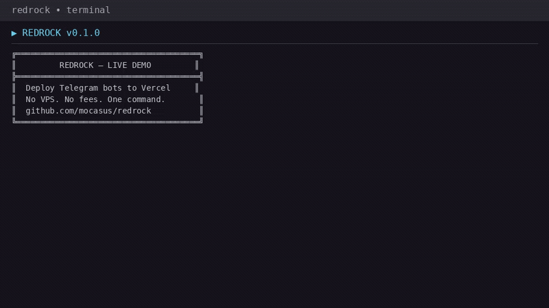

<p align="center">
  
</p>

<h3 align="center">Redrock</h3>

<p align="center">
  Deploy Telegram bots to Vercel — no VPS, no fees, one command.
</p>

<p align="center">
  <a href="https://www.npmjs.com/package/@mocasus/redrock"></a>
  <a href="https://github.com/mocasus/redrock/blob/main/LICENSE"></a>
  
  
</p>

<p align="center">
  
</p>

---

## What is Redrock?

You have a Telegram bot idea. Normally you'd need a VPS ($6/mo), nginx, webhooks, SSL certs — just to reply "hello" to a message.

**Redrock makes it one command.** 

It scaffolds a Python bot (pure stdlib, zero pip deps), pushes it to Vercel's free tier, and auto-registers the webhook with Telegram. Your bot scales to zero when idle, wakes instantly on the next message, and costs nothing.

No config files to wrestle with. No server to maintain. Just `redrock deploy`.

---

## Install

```bash
npm i -g @mocasus/redrock
```

After install, `redrock` is available globally:

```bash
redrock                 # show banner
redrock --help          # list commands
redrock init my-bot     # scaffold a bot
```

---

## Quick Start

```bash
redrock init my-bot -t YOUR_BOT_TOKEN
cd my-bot
vercel login
redrock deploy
```

Done. Open Telegram, send `/start` to your bot.

---

## Commands

| Command | |
|---------|---|
| `redrock init <name> -t <token>` | scaffold a new bot |
| `redrock deploy` | push to Vercel + register webhook |
| `redrock logs --follow` | stream live request logs |
| `redrock db init` | setup Vercel KV database |
| `redrock db migrate --to <provider>` | switch database |
| `redrock switch <webhook\|polling>` | toggle update mode |

---

## Features

- **60-second deploy** — scaffold → live webhook. One flow.
- **$0 cost** — Vercel free tier: 100GB bandwidth, scales to zero
- **Python stdlib** — generated bot uses zero pip dependencies
- **Built-in DB** — Vercel KV, Supabase, Firebase via `redrock db init`
- **Live logs** — `redrock logs --follow` streams in real-time

---

## Database

```bash
redrock db init
```

Provisions Vercel KV + generates `api/db.py`:

```python
from api.db import db
db.set("visits", 42)
count = db.get("visits")  # → 42
```

| Provider | Free Tier |
|----------|-----------|
| Vercel KV | 256 MB |
| Supabase | 500 MB PostgreSQL |
| Firebase | 1 GB Firestore |

---

## VPS vs Redrock

| | VPS | Redrock |
|---|---|---|
| Price | $6+/mo | **$0** |
| Setup | 30-60 min | **60 sec** |
| Maintenance | OS, nginx, certs | **None** |

---

## Docs

- [Setup Guide](docs/README.md)
- [▶️ Demo video](docs/demo.mp4)

---

<p align="center">
  <sub>v0.1.1 · <a href="https://github.com/mocasus/redrock">GitHub</a> · <a href="https://www.npmjs.com/package/@mocasus/redrock">npm</a> · MIT</sub>
</p>
